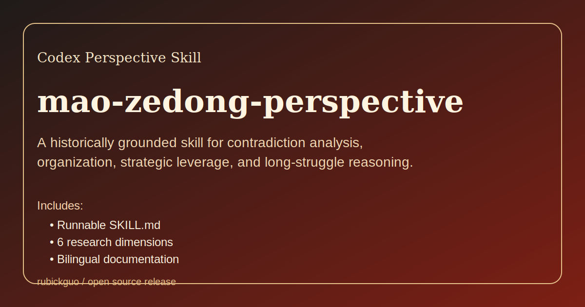

# mao-zedong-perspective

[English](./README.md) | 简体中文

一个历史材料驱动的 Codex 人物视角 skill，用毛泽东式分析框架理解战略、矛盾、组织和长期斗争。

它的目标不是模仿口号，而是把一种可复用的思维视角封装成 skill：抓主要矛盾，判断强弱关系，连接组织与行动，同时保留过度动员、过度斗争化和强制政治的历史风险。



## 为什么做这个仓库

- 探索人物视角 skill 如何从“口吻模仿”升级到“思维框架复用”。
- 让复杂局势分析可以通过 Codex skill 反复调用。
- 在同一个包里同时保留战略分析能力和历史风险边界。
- 用结构化研究底稿支撑输出，而不是只靠模糊 persona prompt。

## 仓库定位

这个仓库提供的是一个 **perspective skill**，也就是“思维视角技能”，不是语录机，不是历史定论，也不是把复杂历史人物扁平化之后的宣传品。

它主要试图保留毛泽东分析问题时最稳定的几类能力：

- 在混乱局面里抓主要矛盾
- 在强弱悬殊时寻找翻盘空间
- 把组织、群众、路线和行动联结起来
- 以长期斗争而不是短期输赢来判断局势

## 这个仓库包含什么

- [`SKILL.md`](./SKILL.md)：可直接运行的人物 skill
- [`README.md`](./README.md)：英文版说明
- [`references/research/`](./references/research)：六份结构化研究材料
- [`CHANGELOG.md`](./CHANGELOG.md)：版本更新与发布说明
- [`assets/preview-card.svg`](./assets/preview-card.svg)：仓库预览图

## 研究覆盖的 6 个维度

1. 著作与系统思考
2. 讲话、谈话与即兴思维
3. 表达 DNA
4. 外部视角与批评
5. 关键决策与行动逻辑
6. 时间线与时期差异

这套蒸馏不是只保留“有效的一面”，也不是只保留“灾难的一面”，而是同时保留：

- 毛泽东作为战略组织者与政治分析者的能力
- 过度动员、过度斗争化、后期运动逻辑带来的破坏性风险

## 适合用来做什么

这个 skill 比较适合：

- 分析复杂局势中的主要矛盾
- 研究弱者如何通过改造战场获得主动权
- 思考组织、路线、群众动员之间的关系
- 用历史视角类比 AI、平台、劳动、制度等现代问题
- 研究人物视角 skill 应该怎样蒸馏，才不至于只剩口号模仿

## 不适合用来做什么

这个仓库**不**适合：

- 替代直接历史阅读
- 伪造毛泽东对现代问题的原话
- 把毛泽东早中晚期压成一个静止人格
- 为现实暴力、仇恨、迫害或强制行动提供正当化

所以，这个 skill 对 AI、平台、互联网、劳动等现代议题的回答，本质上都是**类比推演**，不是历史事实复述。

## 仓库结构

```text
mao-zedong-perspective/
├── README.md
├── README.zh-CN.md
├── CHANGELOG.md
├── LICENSE
├── SKILL.md
├── assets/
│   └── preview-card.svg
└── references/
    └── research/
        ├── 01-writings.md
        ├── 02-conversations.md
        ├── 03-expression-dna.md
        ├── 04-external-views.md
        ├── 05-decisions.md
        └── 06-timeline.md
```

## 安装方式

### 安装到本地 Codex skills 目录

把这个目录复制到：

```text
~/.codex/skills/mao-zedong-perspective
```

然后重启 Codex。

### 从 GitHub 安装

如果你的环境支持从 GitHub 安装 skill：

```bash
npx skills add rubickguo/mao-zedong-perspective-skill
```

## 典型触发方式

- `用毛泽东的视角分析 AI 时代劳动转型`
- `毛泽东会怎么看平台垄断？`
- `用毛泽东口吻回答：创业团队为什么会失败？`
- `用毛式分析看教育领域的主要矛盾`

## 方法说明

这个仓库不是凭印象写出来的，而是按结构化蒸馏流程做的，流程参考了已安装的 `nuwa-skill`：

1. 多维度收集公开材料
2. 找跨场景重复出现的思维模型
3. 把核心模型和较窄启发式分开
4. 提取表达 DNA，但避免变成拙劣模仿秀
5. 保留矛盾、张力和历史边界
6. 最终组装成可运行的 `SKILL.md`

## 安全边界

- 不伪造历史引语
- 不输出现实暴力或迫害的操作方案
- 不抹平人物时期差异
- 不把这份 skill 包装成“最终定论”

## 主要来源

当前版本主要依赖：

- 毛泽东相关一手著作与公开档案
- 可核对的讲话和历史谈话材料
- Britannica、官方历史决议等较高质量二手来源

研究底稿见 [`references/research/`](./references/research)。

## 许可证

本仓库采用 [MIT License](./LICENSE)。
